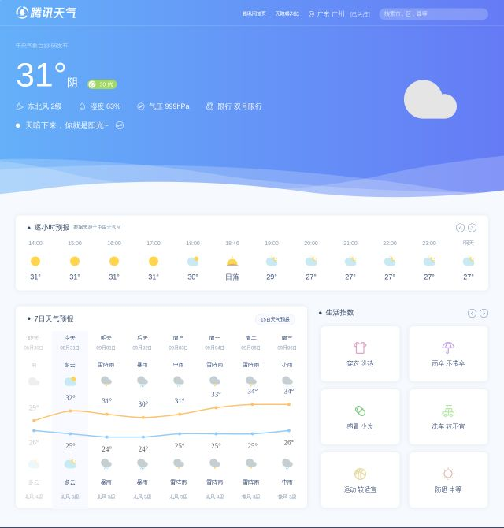
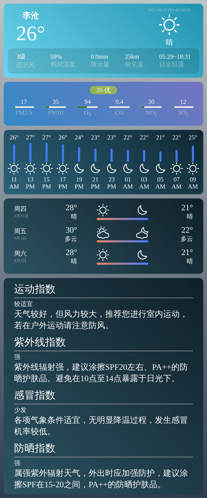

# QChatAIPaint

适用于[QChatGPT](https://github.com/RockChinQ/QChatGPT)的天气插件
<br>
代码参考于[nonebot-plugin-heweather](https://github.com/kexue-z/nonebot-plugin-heweather)

## 1、前置工作

- 在[和风天气](https://dev.qweather.com/)申请apikey
- 下载本插件`!plugin get https://github.com/oliverkirk-sudo/QChatWeather.git`
- 可选安装[QChatMarkdown](https://github.com/oliverkirk-sudo/QChatMarkdown),安装后启用配置文件中的选项，不安装则使用默认生成

<details>
<summary>安装QChatMarkdown前</summary>



</details>

<details>
<summary>安装QChatMarkdown后</summary>



</details>

## 2、修改配置文件

```python
class Config:
    qweather_apikey: Optional[str] = '' # 和风天气apikey
    qweather_apitype: Optional[int] = 0 # apikey类型 0 -> 免费订阅, 1 -> 标准订阅, 2 -> 商业版
    qweather_info: Optional[str] = '1,5,9,16' # 天气指数，具体看https://dev.qweather.com/docs/resource/indices-info/
    qweather_hourlytype: Optional[HourlyType] = HourlyType.current_12h
    debug: bool = False
}
```

## 3、包含的指令

用户使用命令：

- aipaint help 获取帮助
- 随机图片生成：【aipaint随机图片】或【aipaint随机】或【aipaint随机生成】
- 条件随机图片生成：【aipaint条件随机model?width?height?steps?cfg_scale?num_images】
- 默认配置条件生成：【aipaint默认生成tag?ntag】
- 条件图片生成：【aipaint条件生成tag?ntag?model?width?height?steps?cfg_scale?num_images】

管理员使用命令：

- !aipaint on 开启ai绘画
- !aipaint off 关闭ai绘画
- !aipaint set <option> 设置用户权限
- !aipaint <option> <value> 设置配置项的默认值

</br>
<b>该软件仅供学习交流，一切由该软件产生的不良影响由使用者承担</b>
</br>
